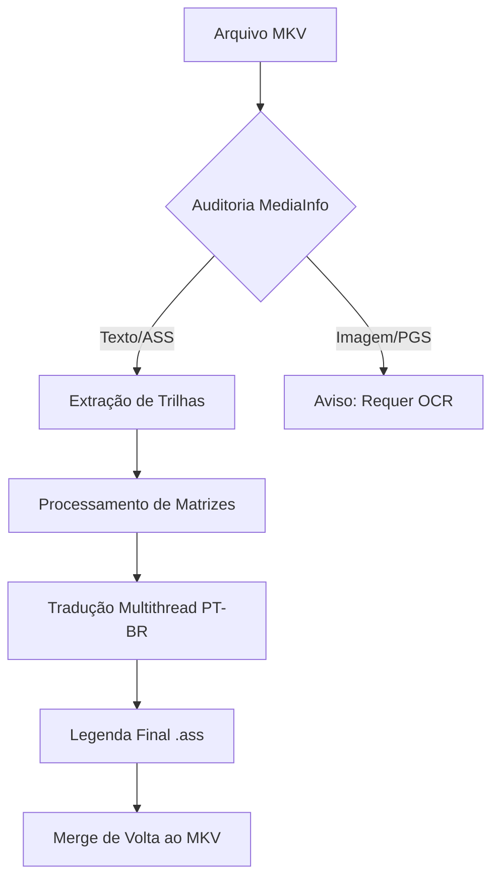

# 🤖 Anime Subtitle Automation & Translation (ASAT)

<p align="center">
  
  
  
  
</p>

---

## 📝 Descrição

O **ASAT** é um conjunto de ferramentas robustas desenvolvidas em Python para automatizar o workflow de tradução de animes. Focado especialmente em séries clássicas e de alta fidelidade (como a franquia **Gundam**), o projeto permite extrair, analisar e traduzir legendas de arquivos MKV com preservação de formatação avançada (ASS/SSA).

Utiliza técnicas de **Multithreading** para acelerar a tradução via Google Translate API, garantindo que mesmo arquivos com milhares de linhas sejam processados em segundos.

---

## ✨ Principais Funcionalidades

- 🔍 **Auditoria Técnica**: Análise profunda de arquivos MKV (Resolução, Bitrate, Profundidade de Cor e tipos de trilhas).
- 📦 **Extração Automatizada**: Integração direta com `mkvextract` para isolar trilhas de áudio e legenda.
- ⚡ **Tradução Turbo**: Processamento paralelo (Multithreading) com proteção de tags ASS/SSA (evita que o tradutor corrompa estilos de legenda).
- 📊 **Identificação de Trilhas**: Diferenciação automática entre legendas baseadas em texto (SRT/ASS) e baseadas em imagem (PGS/VobSub).

---

## 🛠️ Tech Stack

| Ferramenta | Utilidade |
| :--- | :--- |
| **Python** | Linguagem Core |
| **MKVToolNix** | Manipulação de containers MKV |
| **Deep Translator** | Motor de tradução (Google API) |
| **MediaInfo** | Metadados técnicos de vídeo |
| **Tqdm** | Barras de progresso elegantes |
| **Colorama** | Feedback visual no terminal |

---

## 🚀 Workflow do Projeto



---

## ⚙️ Instalação e Uso

### Pré-requisitos
- [Python 3.10+](https://www.python.org/)
- [MKVToolNix](https://mkvtoolnix.download/) (Adicionado ao PATH do sistema ou configurado nos scripts)

### Passo a Passo
1. Clone o repositório:
   ```bash
   git clone https://github.com/seu-usuario/TRADUCAO_ANIMES_PROJETO.git
   ```
2. Instale as dependências:
   ```bash
   pip install deep-translator tqdm colorama pymediainfo
   ```
3. Execute a auditoria para identificar as trilhas:
   ```bash
   python pesquisar-arquiv-video.py
   ```
4. Execute o tradutor turbo:
   ```bash
   python tradutor-legenda-ptbr.py
   ```

---

## 🛡️ Segurança de Tags
O tradutor possui um mecanismo de Regex que protege códigos como `{\an8}`, `{\i1}` ou `{\fnArial}`, garantindo que o tradutor automático não tente traduzir ou quebrar a sintaxe do Advanced Substation Alpha.

---

## 🤝 Contribuição

Contribuições são bem-vindas! Se você tiver ideias para melhorar o suporte a OCR ou integração com outras APIs de tradução, sinta-se à vontade para abrir uma issue ou enviar um PR.

---

## 📜 Licença

Distribuído sob a licença MIT. Veja `LICENSE` para mais informações.

---
<p align="center">
  Desenvolvido com ❤️ para a comunidade de Fansubbing.
</p>

## 👨‍💻 Desenvolvedor

**Paulo André Carminati** | RM570877 | 1-TDCPV  
🛡️ **Cyber Defense** | CyberSegurança  
🎓 **FIAP 2026**  
💻 **Python Specialist**  

[](https://github.com/carmipa)