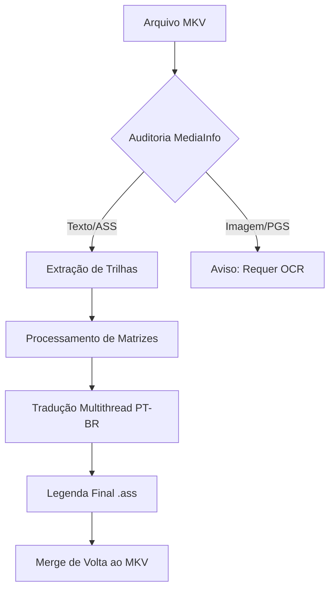

<h1 align="center">🤖 Project ASAT: Neural Subtitle Translation & I/O Engineering</h1>

<p align="center">
  <i>"Se a gravidade do mercado nos impede de acessar a cultura com qualidade, usaremos a tecnologia para libertar nossas mentes (e nossos arquivos)."</i>
</p>

<p align="center">
  
  
  
  
</p>

---

## 📌 Índice
- [🌌 Contexto & Inspiração](#contexto--inspiração-o-manifesto-de-dakar)
- [📝 Descrição](#descrição)
- [✨ Principais Funcionalidades](#principais-funcionalidades)
- [🛠️ Tech Stack](#tech-stack)
- [🚀 Workflow do Projeto](#workflow-do-projeto)
- [⚙️ Instalação e Uso](#instalação-e-uso)
- [🛡️ Segurança de Tags](#segurança-de-tags)
- [🚀 Case Study: Otimização de I/O](#case-study-otimização-de-io-gundam-f91)
- [🤝 Contribuição](#contribuição)
- [📜 Licença](#licença)
- [👨‍💻 Desenvolvedor](#desenvolvedor)

---

## 🌌 Contexto & Inspiração: O Manifesto de Dakar

Este projeto nasceu da necessidade de tratar com o devido respeito e precisão técnica as obras-primas da animação japonesa, especialmente a saga **Mobile Suit Gundam**. A fidelidade ao roteiro original é o pilar que sustenta o desenvolvimento desta ferramenta.

### 📽️ Mobile Suit Zeta Gundam - O Dia de Dakar (Ep. 37)

O cenário é icônico: Char Aznable invade a assembleia da Federação Terrestre para revelar ao mundo as atrocidades dos Titans e reivindicar o legado de seu pai, Zeon Deikun.

#### 🎙️ O Texto Original vs. Tradução Técnica Revisada
>
> **Japonês:** 「地球は、人間の手で汚すものではない！ 人類が地球から離れることは、地球を休ませるためだ。人類は、自分の重みで地球を潰してはならないのだ。地球を汚し、魂を引力に引かれた人々が、地球をダメにしているのだ！」
>
> **PT-BR:** "A Terra não é algo para ser poluído pelas mãos dos homens! O afastamento da humanidade da Terra serve para que o planeta possa descansar. A humanidade não deve esmagar a Terra com o seu próprio peso. Aqueles que poluem o planeta e cujas almas permanecem presas pela força da gravidade são os que estão arruinando a Terra!"

#### 🔍 O Poder da IA na Tradução de Nuances

Utilizamos IA avançada e APIs de tradução para capturar o que legendas convencionais perdem:

* **O Verbo "Yasumaseru" (休ませる)**: Mais do que "deixar em paz", é **"fazer descansar"**. A Terra é vista como um organismo que precisa de um período de repouso (*fallow*) da atividade humana.
* **O Conceito de "Inryoku" (引力)**: Literalmente "Gravidade". Na filosofia de Yoshiyuki Tomino, estar "preso pela gravidade" é uma metáfora para a estagnação espiritual. No áudio original, a entonação do dublador Shuichi Ikeda em *Inryoku* define o tom épico da cena.
* **"Dame ni shite iru" (ダメにしている)**: Uma forma forte de dizer **"arruinar"** ou tornar estéril. A ferramenta busca preservar essa força acusatória contra a elite que degrada o planeta.

---

## 📝 Descrição

Este é um conjunto de ferramentas robustas desenvolvidas em Python para automatizar o workflow de tradução de animes. Focado especialmente em séries clássicas e de alta fidelidade (como a franquia **Gundam**), o projeto permite extrair, analisar e traduzir legendas de arquivos MKV com preservação de formatação avançada (ASS/SSA).

Utiliza técnicas de **Multithreading** para acelerar a tradução via Google Translate API, garantindo que mesmo arquivos com milhares de linhas sejam processados em segundos.

---

## ✨ Principais Funcionalidades

* 🔍 **Auditoria Técnica**: Análise profunda de arquivos MKV (Resolução, Bitrate, Profundidade de Cor e tipos de trilhas).
* 📦 **Extração Automatizada**: Integração direta com `mkvextract` para isolar trilhas de áudio e legenda.
* ⚡ **Tradução Turbo**: Processamento paralelo (Multithreading) com proteção de tags ASS/SSA (evita que o tradutor corrompa estilos de legenda).
* 📊 **Identificação de Trilhas**: Diferenciação automática entre legendas baseadas em texto (SRT/ASS) e baseadas em imagem (PGS/VobSub).

---

## 🛠️ Tech Stack

| Ferramenta | Utilidade |
| :--- | :--- |
| **Python** | Linguagem Core |
| **MKVToolNix** | Manipulação de containers MKV |
| **Deep Translator** | Motor de tradução (Google API) |
| **MediaInfo** | Metadados técnicos de vídeo |
| **Tqdm** | Barras de progresso elegantes |
| **Colorama** | Feedback visual no terminal |

---

## 🚀 Workflow do Projeto



---

## ⚙️ Instalação e Uso

### Pré-requisitos

* [Python 3.10+](https://www.python.org/)
* [MKVToolNix](https://mkvtoolnix.download/) (Adicionado ao PATH do sistema ou configurado nos scripts)

### Passo a Passo

1. Clone o repositório:

   ```bash
   git clone https://github.com/seu-usuario/TRADUCAO_ANIMES_PROJETO.git
   ```

2. Instale as dependências:

   ```bash
   pip install deep-translator tqdm colorama pymediainfo
   ```

3. Execute a auditoria para identificar as trilhas:

   ```bash
   python pesquisar-arquiv-video.py
   ```

4. Execute o tradutor turbo:

   ```bash
   python tradutor-legenda-ptbr.py
   ```

---

## 🛡️ Segurança de Tags

O tradutor possui um mecanismo de Regex que protege códigos como `{\an8}`, `{\i1}` ou `{\fnArial}`, garantindo que o tradutor automático não tente traduzir ou quebrar a sintaxe do Advanced Substation Alpha.

---

## 🚀 Case Study: Otimização de I/O (Gundam F91)

Este projeto não foca apenas na tradução, mas também na performance de engenharia de dados. Abaixo, detalhamos como superamos gargalos de hardware para processar arquivos massivos.

### 1. O Problema de Origem

* **Falta de Fidelidade**: Identificamos que o "discurso do chá" em *Gundam F91* estava mal traduzido nas versões disponíveis em português, perdendo a profundidade do roteiro original.
* **Gargalo de Hardware**: Processar arquivos de vídeo de alta definição (MKV) e milhares de linhas de tradução gera um estresse de I/O (leitura/escrita) constante no SSD, aumentando a latência e diminuindo a vida útil do hardware.

### 2. A Solução: RAM Disk com ImDisk

Utilizamos um setup de **64 GB de RAM** para criar uma unidade virtual de **45 GB**.

* **Hacking de Infraestrutura**: Ao mover os arquivos de trabalho para a memória RAM (volátil), eliminamos o gargalo do SSD.
* **Velocidade Extrema**: Tarefas de 18 GB foram concluídas em apenas alguns segundos — um ganho de performance superior a **1000%** comparado ao processamento em disco sólido (SSD) tradicional.

### 3. Arquitetura da Solução

| Camada | Tecnologia | Impacto |
| :--- | :--- | :--- |
| **Hardware** | RAM Disk 45GB (ImDisk) | Latência zero, proteção do ciclo de vida do SSD. |
| **Automação** | Python Scripts + Google API | Tradução em massa com preservação de fidelidade. |
| **Remux** | MKVToolNix (mkvmerge) | Recombinação instantânea dentro do ambiente de RAM. |

### 📊 Resultados
>
> A otimização permitiu iterações rápidas de tradução e remux, garantindo que a correção do diálogo filosófico fosse validada em tempo real, sem a espera exaustiva de processos de escrita em disco.

---

## 🤝 Contribuição

Contribuições são bem-vindas! Se você tiver ideias para melhorar o suporte a OCR ou integração com outras APIs de tradução, sinta-se à vontade para abrir uma issue ou enviar um PR.

---

## 📜 Licença

Distribuído sob a licença MIT. Veja `LICENSE` para mais informações.

---
<p align="center">
  Desenvolvido com ❤️ para a comunidade de Fansubbing.
</p>

## 👨‍💻 Desenvolvedor

**Paulo André Carminati** | RM570877 | 1-TDCPV  
🛡️ **Cyber Defense** | CyberSegurança  
🎓 **FIAP 2026**  
💻 **Python Specialist**  

[](https://github.com/carmipa)
