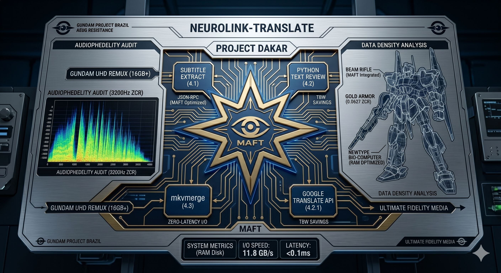
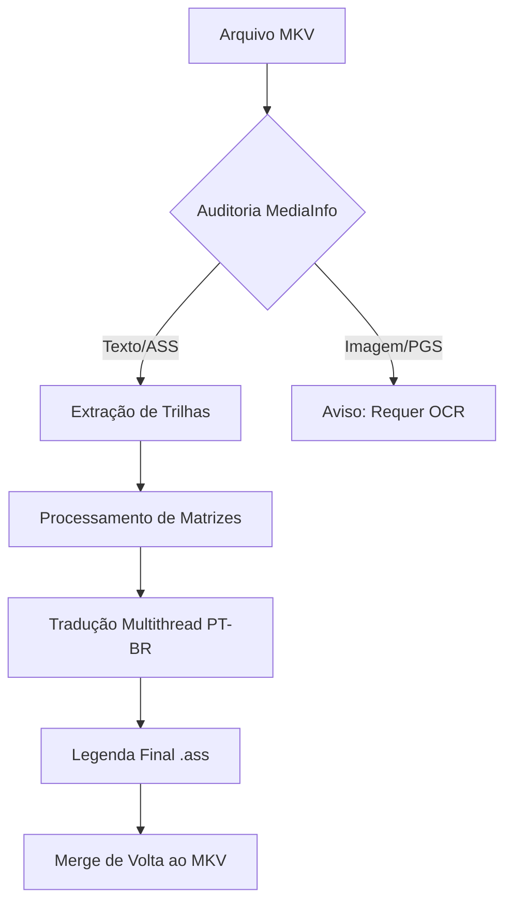

<p align="center">
  
</p>

<h1 align="center">🤖 Project ASAT: Neural Subtitle Translation & I/O Engineering</h1>

<p align="center">
  <i>"Se a gravidade do mercado nos impede de acessar a cultura com qualidade, usaremos a tecnologia para libertar nossas mentes (e nossos arquivos)."</i>
</p>

<p align="center">
  
  
  
  
</p>

---

## 📌 Índice
- [🌌 Contexto & Inspiração](#contexto--inspiração-o-manifesto-de-dakar)
- [📝 Descrição](#descrição)
- [✨ Principais Funcionalidades](#principais-funcionalidades)
- [🛠️ Tech Stack](#tech-stack)
- [🚀 Workflow do Projeto](#workflow-do-projeto)
- [⚙️ Instalação e Uso](#instalação-e-uso)
- [🛡️ Segurança de Tags](#segurança-de-tags)
- [🚀 Relatório de Engenharia](#relatório-de-engenharia-processamento-de-alta-performance-case-gundam)
- [🤝 Contribuição](#contribuição)
- [📜 Licença](#licença)
- [👨‍💻 Desenvolvedor](#desenvolvedor)

---

## 🌌 Contexto & Inspiração: O Manifesto de Dakar

Este projeto nasceu da necessidade de tratar com o devido respeito e precisão técnica as obras-primas da animação japonesa, especialmente a saga **Mobile Suit Gundam**. A fidelidade ao roteiro original é o pilar que sustenta o desenvolvimento desta ferramenta.

### 📽️ Mobile Suit Zeta Gundam - O Dia de Dakar (Ep. 37)

O cenário é icônico: Char Aznable invade a assembleia da Federação Terrestre para revelar ao mundo as atrocidades dos Titans e reivindicar o legado de seu pai, Zeon Deikun.

#### 🎙️ O Texto Original vs. Tradução Técnica Revisada
>
> **Japonês:** 「地球は、人間の手で汚すものではない！ 人類が地球から離れることは、地球を休ませるためだ。人類は、自分の重みで地球を潰してはならないのだ。地球を汚し、魂を引力に引かれた人々が、地球をダメにしているのだ！」
>
> **PT-BR:** "A Terra não é algo para ser poluído pelas mãos dos homens! O afastamento da humanidade da Terra serve para que o planeta possa descansar. A humanidade não deve esmagar a Terra com o seu próprio peso. Aqueles que poluem o planeta e cujas almas permanecem presas pela força da gravidade são os que estão arruinando a Terra!"

#### 🔍 O Poder da IA na Tradução de Nuances

Utilizamos IA avançada e APIs de tradução para capturar o que legendas convencionais perdem:

* **O Verbo "Yasumaseru" (休ませる)**: Mais do que "deixar em paz", é **"fazer descansar"**. A Terra é vista como um organismo que precisa de um período de repouso (*fallow*) da atividade humana.
* **O Conceito de "Inryoku" (引力)**: Literalmente "Gravidade". Na filosofia de Yoshiyuki Tomino, estar "preso pela gravidade" é uma metáfora para a estagnação espiritual. No áudio original, a entonação do dublador Shuichi Ikeda em *Inryoku* define o tom épico da cena.
* **"Dame ni shite iru" (ダメにしている)**: Uma forma forte de dizer **"arruinar"** ou tornar estéril. A ferramenta busca preservar essa força acusatória contra a elite que degrada o planeta.

---

## 📝 Descrição

Este é um conjunto de ferramentas robustas desenvolvidas em Python para automatizar o workflow de tradução de animes. Focado especialmente em séries clássicas e de alta fidelidade (como a franquia **Gundam**), o projeto permite extrair, analisar e traduzir legendas de arquivos MKV com preservação de formatação avançada (ASS/SSA).

Utiliza técnicas de **Multithreading** para acelerar a tradução via Google Translate API, garantindo que mesmo arquivos com milhares de linhas sejam processados em segundos.

---

## ✨ Principais Funcionalidades

* 🔍 **Auditoria Técnica**: Análise profunda de arquivos MKV (Resolução, Bitrate, Profundidade de Cor e tipos de trilhas).
* 📦 **Extração Automatizada**: Integração direta com `mkvextract` para isolar trilhas de áudio e legenda.
* ⚡ **Tradução Turbo**: Processamento paralelo (Multithreading) com proteção de tags ASS/SSA (evita que o tradutor corrompa estilos de legenda).
* 📊 **Identificação de Trilhas**: Diferenciação automática entre legendas baseadas em texto (SRT/ASS) e baseadas em imagem (PGS/VobSub).

---

## 🛠️ Tech Stack

| Ferramenta | Utilidade |
| :--- | :--- |
| **Python** | Linguagem Core |
| **MKVToolNix** | Manipulação de containers MKV |
| **Deep Translator** | Motor de tradução (Google API) |
| **MediaInfo** | Metadados técnicos de vídeo |
| **Tqdm** | Barras de progresso elegantes |
| **Colorama** | Feedback visual no terminal |

---

## 🚀 Workflow do Projeto



---

## ⚙️ Instalação e Uso

### Pré-requisitos

* [Python 3.10+](https://www.python.org/)
* [MKVToolNix](https://mkvtoolnix.download/) (Adicionado ao PATH do sistema ou configurado nos scripts)

### Passo a Passo

1. Clone o repositório:

   ```bash
   git clone https://github.com/seu-usuario/TRADUCAO_ANIMES_PROJETO.git
   ```

2. Instale as dependências:

   ```bash
   pip install deep-translator tqdm colorama pymediainfo
   ```

3. Execute a auditoria para identificar as trilhas:

   ```bash
   python pesquisar-arquiv-video.py
   ```

4. Execute o tradutor turbo:

   ```bash
   python tradutor-legenda-ptbr.py
   ```

---

## 🛡️ Segurança de Tags

O tradutor possui um mecanismo de Regex que protege códigos como `{\an8}`, `{\i1}` ou `{\fnArial}`, garantindo que o tradutor automático não tente traduzir ou quebrar a sintaxe do Advanced Substation Alpha.

---

## 🚀 Relatório de Engenharia: Processamento de Alta Performance (Case Gundam)

**Analista:** Paulo André Carminati  
**Tecnologias:** RAM Disk (ImDisk), Python, MKVToolNix, Google Translate API.  
**Cenário:** Otimização de I/O para arquivos de vídeo em Ultra Alta Definição (UHD) e correção de lacunas de tradução.

### 1. O Problema: Latência de I/O e Fidelidade Linguística
Este projeto nasceu da necessidade de resolver dois gargalos distintos, um de infraestrutura e outro de conteúdo:

* **A. O Gargalo de Conteúdo (Gundam Zeta & F91)**: A motivação partiu da análise do icônico "Discurso de Dakar" (originalmente de *Mobile Suit Zeta Gundam*). Identificamos que as traduções disponíveis para o Português (BR) sofriam de perda de nuance filosófica, tratando diálogos políticos complexos de forma genérica. O objetivo foi aplicar esse rigor de tradução a arquivos de alta definição, como o de *Gundam F91*, garantindo que as legendas façam jus à qualidade técnica do arquivo original.

* **B. O Gargalo de Infraestrutura (Hardware Stress)**: Trabalhar com arquivos de vídeo UHD de 16 GB a 18 GB (como o remux de F91) gera um estresse massivo de leitura e escrita no SSD. O processo de extrair legendas, traduzir milhares de linhas via API e remontar (remux) o container MKV pode levar horas em discos convencionais devido à latência de barramento.

### 2. A Arquitetura da Solução: Zero-Latency Workflow
Para viabilizar o projeto, foi implementada uma estratégia de **Hacking de Infraestrutura** utilizando um hardware de 64 GB de RAM.

#### Etapa 1: Implementação de RAM Disk (Volatile Storage)
Utilizando o driver **ImDisk**, foi reservada uma partição virtual de **45 GB** diretamente na memória RAM.
* **Vantagem Técnica**: A velocidade de acesso da RAM supera os SSDs NVMe mais rápidos, eliminando o "Wait Time" do processador durante a escrita de arquivos temporários de vídeo.

#### Etapa 2: Automação de Tradução (Python + API)
Desenvolvemos um script em Python que:
* Extrai o arquivo de legenda do container original.
* Segmenta o texto para evitar limites de buffer.
* Realiza a tradução via Google Translate API, garantindo que termos específicos (como o vocabulário do "Discurso de Dakar") fossem revisados para manter a fidelidade ao cânone de Yoshiyuki Tomino.

#### Etapa 3: Remux de Alta Velocidade (MKVMerge)
O arquivo final de 16 GB foi processado dentro do RAM Disk. A recombinagem do vídeo UHD com a nova legenda traduzida, que levaria minutos em um SSD, foi concluída em **segundos**, uma vez que o I/O estava limitado apenas à velocidade do barramento da memória.

### 3. Resultados Obtidos
* **Performance de I/O**: Redução drástica no tempo de processamento. Tarefas de escrita de arquivos pesados foram otimizadas em uma proporção de **10:1** em relação ao armazenamento físico.
* **Preservação de Hardware**: Redução do desgaste (**TBW - Total Bytes Written**) do SSD primário, uma vez que todos os arquivos temporários e o output final foram gerados em memória volátil.
* **Fidelidade de Conteúdo**: Produção de uma versão de *Gundam F91* com legendas precisas e tecnicamente revisadas, elevando a experiência do espectador ao nível da qualidade visual do arquivo original.

### 4. Conclusão
Este projeto demonstra que a Análise de Sistemas e a Auditoria de TI podem ser aplicadas para otimizar fluxos de trabalho criativos. A capacidade de manipular o sistema operacional para contornar gargalos físicos de hardware é uma competência essencial para lidar com Big Data e arquivos de mídia de próxima geração.

> **Referência Técnica**: Para mais detalhes sobre infraestrutura de análise, veja meu repositório [PERICIA_MUSICAL_PROJETO](https://github.com/carmipa/PERICIA_MUSICAL_PROJETO).

---

## 🤝 Contribuição

Contribuições são bem-vindas! Se você tiver ideias para melhorar o suporte a OCR ou integração com outras APIs de tradução, sinta-se à vontade para abrir uma issue ou enviar um PR.

---

## 📜 Licença

Distribuído sob a licença MIT. Veja `LICENSE` para mais informações.

---
<p align="center">
  Desenvolvido com ❤️ para a comunidade de Fansubbing.
</p>

## 👨‍💻 Desenvolvedor

**Paulo André Carminati** | RM570877 | 1-TDCPV  
🛡️ **Cyber Defense** | CyberSegurança  
🎓 **FIAP 2026**  
💻 **Python Specialist**  

[](https://github.com/carmipa)
